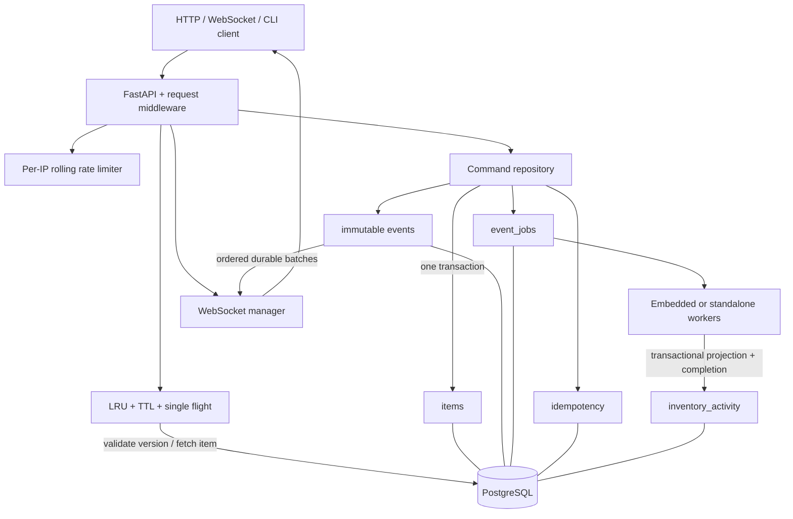
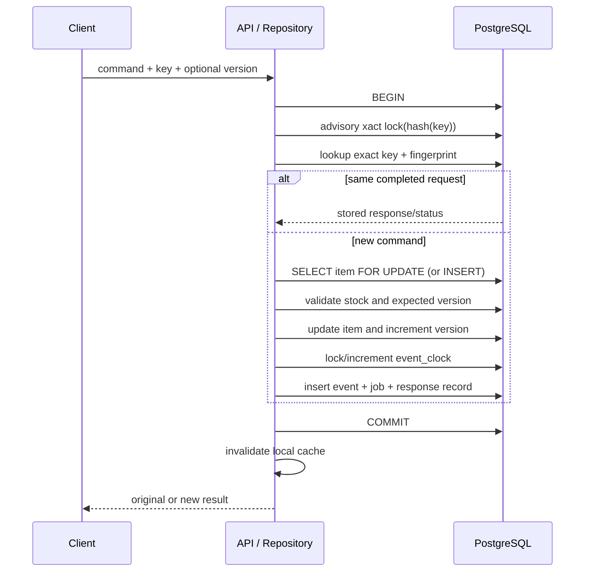

# EventVault architecture

## Ownership and boundaries

`main.py` assembles process-local dependencies and defines HTTP schemas/routing; `repository.py` owns SQL and command rules; `db.py` owns pools/migrations; `cache.py`, `rate_limit.py`, and `metrics.py` own bounded process state. `worker.py` owns durable projection processing; `websocket.py` owns connection lifecycles. `replay.py` verifies event history independently of current state. `cli.py` operates these components. There are no module-global caches or pools. One process uses one asyncio event loop, so map/counter mutations that contain no await are atomic relative to its coroutines. Objects must not be shared across OS threads/event loops.

## Command transaction

All durable writes use one acquired asyncpg connection and transaction. Any exception, disconnect cancellation before commit, constraint failure, or injected fault rolls everything back. If the server commits but the HTTP response is lost, retrying the same key recovers the stored response. The idempotency key is globally unique; the SHA-256 fingerprint includes operation, aggregate ID, validated body, and `If-Match-Version`. Advisory hash collisions can serialize unrelated work but cannot merge responses because exact keys are checked in PostgreSQL. Successful responses persist indefinitely. Failed requests can be retried because no response record commits.

Row locks enforce inventory invariants under concurrent reserve/release. CHECK/UNIQUE constraints are the last guard. Optimistic concurrency is complementary: row locks protect current state while `If-Match-Version` rejects a client's stale business decision. A retry of a completed idempotent request returns its original result even if its version header would now be stale.

## Event identity and historical pagination

`event_id` is a UUID; `id` is the ordered feed cursor; `(aggregate_id, aggregate_version)` is unique and indexed. Type, creation time, and idempotency key have indexes. `events` has an UPDATE/DELETE/TRUNCATE rejection trigger. Mutable processing metadata lives in `event_jobs`, preserving strict business-event immutability.

A BIGSERIAL sequence alone is unsafe as a polling watermark: transaction A can allocate 10, B commit 11, a client observe 11, then A commit 10 and get skipped forever. Instead, a single-row `event_clock` is updated **late** in each transaction. Its row lock lasts through commit; a later cursor cannot become visible before an earlier one commits or rolls back. This adds a global contention point, deliberately chosen for this small PostgreSQL-only implementation. Item sequences may have gaps; event cursors are allocated transactionally.

The first `/events` request reads the committed clock as an upper bound. Pages use `id > after AND id <= upper ORDER BY id LIMIT n+1`; no OFFSET. URL-safe base64 JSON stores format version, last ID, upper bound, and a digest of filters. Limits/IDs/types are validated, and changing filters invalidates a cursor. Cursors are not authorization tokens and are not signed: a caller may seek within data it is already authorized to query. New writes beyond the snapshot belong to a fresh traversal. A timestamp filter requires an explicit UTC offset and supports inclusive endpoints. Aggregate WebSocket replay uses the compound version index directly.

## Cache consistency

A flight encompasses the entire read, including version validation. Concurrent callers join an asyncio task; shielding means one cancelled client cannot cancel shared work. Completed entries live in an OrderedDict, with monotonic expiry and bounded LRU eviction. Returned copies avoid caller mutation of shared entries. Errors are never cached. Capacity zero bypasses both storage and coalescing to make the baseline benchmark explicit.

On a hit, read the authoritative PostgreSQL version. A different/missing version discards the entry and reloads the full row. On writes, invalidate the local entry and detach any in-progress flight so subsequent callers revalidate. An already-running read may return the state immediately before an overlapping write, which is a valid linearization. Later non-overlapping requests cannot return stale versions. A slow old flight can repopulate an old snapshot, but the next reader detects it; TTL is not the correctness mechanism. A cache injection failure falls back to the repository.

This trades a lightweight version query for multi-process correctness. A cache hit is a validated flight, not every waiting HTTP request. Metrics distinguish physical repository reads from HTTP totals. ETags use `"item-ID-vVERSION"`; weak validators, comma-separated validators, and `*` are supported for GET. 304 sends no item body.

## Worker and failure recovery

`FOR UPDATE OF j SKIP LOCKED` claims bounded job batches inside one database transaction. Another worker skips locked jobs. Projection updates and `processed_at` commit together, so a crash before commit replays the job with no durable partial projection; a crash after commit sees it complete. Processing uses savepoints: a per-event failure rolls back only that projection update, records an attempt, and schedules capped exponential retry. The fifth failure (configurable) marks the job dead. Operators correct the cause and use `retry-dead`; events remain immutable.

The projection is commutative: creation/update operation counts and reserved/released **unit totals** are additive; `last_event_at` uses GREATEST. Out-of-order jobs therefore converge to the same result. It is intentionally not a current-stock projection. Multi-worker batches can contend on the same projection item, and PostgreSQL may abort a deadlocked batch; the outer loop logs the error and retries later. Connection loss/worker cancellation releases all claims by transaction rollback. No external side effects occur while locks are held.

Within PostgreSQL the projection applies exactly once per completed job. This guarantee cannot be extended to external sends without downstream idempotency. Worker metric increments/logs describe local attempts; durable job rows remain authoritative if a batch aborts after earlier log messages. Process counters reset on restart. `stats` includes durable processed/pending/dead totals.

## WebSocket lifecycle

1. Authenticate using the API token when configured, apply IP handshake limits, reserve a bounded connection slot.
2. Read current item version; reject missing items or a future replay cursor.
3. Accept. If `after_version` is absent, start after the captured current version; otherwise start at the requested version.
4. Read at most 100 immutable events in ascending aggregate version order and send each under a deadline. Advance the connection cursor only after the send completes.
5. Poll for the next batch and periodically send `{type: "heartbeat", after_version: N}`. A separate receive task detects disconnect; uvicorn ping/pong detects transport peers that stop responding.
6. On failure/disconnect, cancel the receiver, release the slot, update metrics, and close with a bounded deadline.

Replay and live delivery share one durable query/cursor; no subscribe/replay race or unbounded event queue exists. Each client has an independent task and send timeout, so a slow connection cannot hold a broadcaster lock. PostgreSQL remains the backlog. The cost is polling traffic proportional to active sockets. Library transport buffers are bounded by uvicorn queue/size options. Clients should persist the last **applied** aggregate version, reconnect with it, and deduplicate events: an acknowledgement lost at disconnect makes exactly-once network delivery impossible here.

## Replay verifier

A read-only REPEATABLE READ transaction captures current item and its event stream consistently while writes continue. A server-side cursor reconstructs create/update/reserve/release operations, checks contiguous versions and stock invariants, checks every event snapshot, then compares every current-state field. It does not merely trust the final snapshot. The seed uses real command transactions, so generated historical states follow the same rules as API traffic.

## Request protection and observability

Pure ASGI middleware bounds streamed bodies to 16 KiB and receive time to ten seconds before JSON parsing. Strict types, length bounds, finite exact prices, positive IDs, forbidden unknown fields, and parameterized SQL constrain inputs. Only application-controlled SQL fragments are interpolated. Request IDs are validated and returned on errors as well as successes. Logs contain UTC timestamp, level, request ID, method, escaped path, status, and duration; worker logs include event UUID/type/attempt/result. Error responses omit internals and submitted input.

The rate limiter uses exact per-IP rolling windows with monotonic time, deque counters, expiry cleanup, and a cap on tracked identities. When that cap is reached it fails closed for new IPs instead of evicting active limits. No await occurs inside the decision. Proxy headers are disabled in the CLI server; deployment must explicitly configure trusted proxies if it wants original client IPs. `/health` and `/ready` bypass auth/rate limits so probes remain useful. All other HTTP requests and WebSocket handshakes count toward the process limit; WebSocket frames do not.

Metrics include all specified counters, total average HTTP latency, and p95 over the latest 10,000 observations. Durations are seconds. `db_read_queries` counts item/version fetches for A/B measurements, not every SQL statement in the system. `/health` confirms the event loop is alive; `/ready` performs a bounded PostgreSQL/schema query. Readiness failing does not mean the process needs to be restarted blindly.
